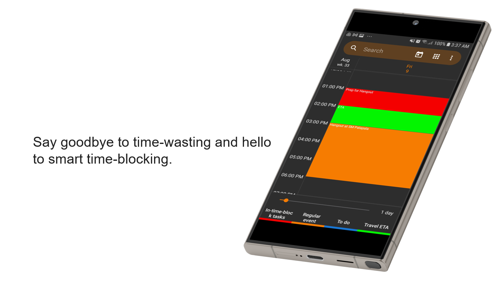

# Simple Calendar

Project Context

People nowadays deal with more complicated issues when it comes to successfully and efficiently managing their time. Conventional calendar applications, with their limited features, ineffective time-blocking, and passive reminders, frequently lack the flexibility needed to effectively manage the dynamic nature of the modern people's schedules. “The world of technical analysis for investing is highly susceptible to analysis paralysis.”(James Chen, 2022) This is an instance of how specific types of people can be impacted by a phenomenon known as "analysis paralysis". “Analysis paralysis is a very old human problem. See Shakespeare's Hamlet for a classic example of the potential perils of over-thinking a decision.”(James Chen, 2022). Furthermore, analysis paralysis induces individuals to procrastinate, despite having knowledge of the tasks at hand. “You convince yourself that the problem is that you haven’t really figured things out enough to get started. As you mentally shift the idea of taking action into the future, your tension subsides you delay it some more.” (Scott Young, 2019).
To address these limitations and the challenges posed by continuous modernization, this project proposes the development and implementation of an advanced calendar system named Aiai Calendar. This system leverages artificial intelligence (AI) technology to enhance traditional calendaring functions and improve time management efficiency.

In designing Aiai Calendar, insights from the study "Artificial Intelligence to Solve Production Scheduling Problems in Real Industrial Settings: Systematic Literature Review" are particularly relevant. This study identifies key AI techniques such as particle swarm optimization (PSO), neural networks (NNs), and reinforcement learning (RL) that have been effectively used in production scheduling to reduce costs, increase energy efficiency, and improve scheduling outcomes (Del Gallo et al, 2023). By incorporating these advanced AI techniques, Aiai Calendar aims to offer a more dynamic and adaptive scheduling solution.
Additionally, findings from "Groupware in Practice: An Interpretation of Work Experiences" underscore the importance of effective interface design and user experience in the adoption of groupware tools. The study highlights that messaging feature helps teams work together more effectively (Team Kissflow, 2024). This insight suggests that for Aiai Calendar to be successful, it must prioritize ease of use and seamless integration of its various functionalities to ensure that users can effectively manage their time without the frustration of navigating complex interfaces.
By integrating AI capabilities and focusing on user-centric design principles, Aiai Calendar seeks to transcend the limitations of conventional calendar applications, offering a robust solution to the time management challenges faced by modern individuals.

Purpose and Description

Aiai Calendar is an AI-driven calendar app to help everybody use their time wisely. This app has a calendar interface through which a user can easily create tasks and events. It offers chat-based scheduling to make quick and easy scheduling using time-blocking to help in breaking down your day into time blocks, Reminders on Events, and Tasks to keep track of your to-do list and make sure to complete them on time. Aiai Calendar stands out with its ability to give personalized AI-driven understanding toward making schedules based on individual needs and preference. It can help ensure time is better managed by having an optimal day, reduce stress by nullifying guesswork and analysis paralysis, and boost productivity with the help of being organized.

email us: aiaidevelopers@duck.com

Download here

    

